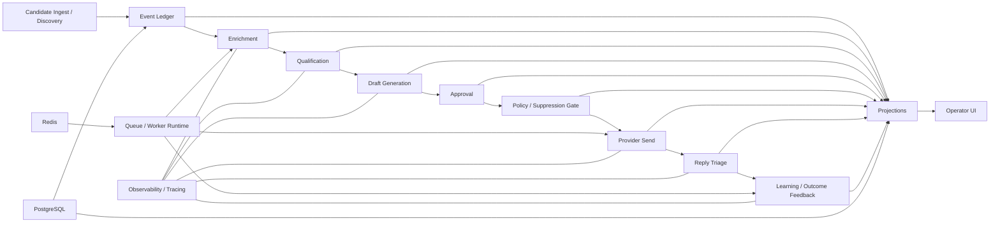

# Supply Program Engine

A production-minded, event-driven outbound intelligence platform built to demonstrate backend, workflow orchestration, and distributed systems engineering.

The system discovers companies, enriches them with deterministic signals, qualifies them, generates outreach drafts, enforces approval and policy gates before sending, processes replies, and records downstream learning signals — all through an append-only event model with replayable state and idempotent side-effect handling.

---

## Why I built this

Most automation demos focus on UI convenience or prompt glue.

This project focuses on the harder engineering problems:

- deterministic workflow progression
- append-only event history
- replayable state
- idempotent processing
- approval before irreversible actions
- policy / suppression checks before send
- provider-backed outbound lifecycle events
- queue-backed worker execution
- tracing and operational visibility

The goal was to build something that looks and behaves more like a real internal automation platform than a simple lead-generation script.

---

## What it does

### Candidate lifecycle
- company ingestion
- provenance-aware discovery tracking
- deterministic enrichment
- qualification and segmentation
- draft generation
- approval gating
- policy / suppression validation
- provider-backed send execution
- reply triage
- outcome / feedback learning

### Platform capabilities
- append-only event ledger
- replayable projections
- queue / worker runtime
- observability hooks
- operator-facing UI
- explicit failure paths

---

## Architecture

The platform is built as an event-driven workflow:

```text
Candidate Ingest
   ↓
Enrichment
   ↓
Qualification
   ↓
Draft Generation
   ↓
Approval
   ↓
Policy / Suppression Gate
   ↓
Provider Send
   ↓
Reply Triage
   ↓
Learning / Outcome Feedback
```

## Architecture Diagram



## Core design principles
- Deterministic workflows over ad hoc automation
- Replayable state from durable events
- Idempotent side effects for safe retries
- Human approval before irreversible sends
- Policy-first execution
- Queue-backed runtime layered on top of the same business logic

## Tech stack
- Python
- FastAPI
- PostgreSQL
- Redis
- HTMX / Jinja
- Tailwind CSS
- Alembic
- Pytest
- Docker
- Lightweight tracing / observability hooks


## What this project demonstrates

This repo is intended to show:

- backend engineering
- event-driven architecture
- workflow orchestration
- idempotency and replayability
- queue / worker runtime design
- policy-aware automation
- provider integration patterns
- reply classification and downstream state updates
- observability-aware system design
- production-minded engineering in a regulated-style workflow


## Key features
### Event-driven workflow engine

The system models business progression through explicit events and projections instead of implicit mutable state.

### Deterministic enrichment and qualification

Website-based enrichment and qualification remain structured and replay-safe.

### Approval + policy gating

Drafts can be generated automatically, but sends are still protected by:

- approval requirements
- suppression checks
- risk/manual-review rules

### Provider-backed send flow

Outbound sending is modeled explicitly through provider lifecycle events, allowing safe auditing of:

- send requested
- send accepted
- send failed
- final sent state

### Reply triage and feedback loop

Inbound replies are classified into bounded outcomes and projected back into entity state, enabling downstream learning signals without self-modifying core rules.

### Queue-backed execution

Background work can be enqueued and executed through a worker runtime while keeping existing synchronous flows intact.


## Local quickstart

### 1. Clone the repo
```bash 
git clone https://github.com/Samuel-McC/supply-program-engine.git
cd supply-program-engine 
```
### 2. Create local environment config
```bash 
cp .env.example .env
```
### 3. Install dependencies
```bash 
make install
```
### 4. Run the app
```bash 
make run
```
### 5. Seed the demo walkthrough
```bash 
make demo-seed
```
The demo seed is deterministic, uses the mock outbound provider in dry-run mode, and is safe to rerun for the same fresh environment.

### 6. Run tests
```bash 
make test
```

If you are using the DB ledger locally, run migrations before starting the app:

```bash 
make db-upgrade
```

## Docker demo quickstart

```bash
make docker-up
make docker-demo-seed
```

When `LEDGER_BACKEND=db`, the app container now runs Alembic migrations automatically on startup before Uvicorn begins serving requests.

## Demo flow

After seeding, open:

- `http://127.0.0.1:8000/ui/candidates`
- `http://127.0.0.1:8000/ui/discovery`

The seed walkthrough creates three realistic entities and runs the existing workflow through:

- candidate ingest
- enrichment
- qualification
- draft generation
- approval
- send / policy gate
- reply triage
- learning feedback

Two entities progress through send and reply outcomes, and one remains blocked at the policy gate for operator review.

## Example API workflow

### Ingest a candidate
```bash 
curl -X POST "http://127.0.0.1:8000/ingress/candidate" \
  -H "Content-Type: application/json" \
  -d '{
    "company_name": "Texas Wood Supply",
    "website": "https://texaswoodsupply.com/",
    "location": "TX",
    "source": "manual",
    "discovered_via": "manual_ingest"
  }'
```
### Run enrichment
```bash 
curl -X POST "http://127.0.0.1:8000/enrichment/run-once?limit=50"
```
### Run qualification
```bash 
curl -X POST "http://127.0.0.1:8000/orchestrator/run-once?limit=50"
```
### Generate drafts
```bash 
curl -X POST "http://127.0.0.1:8000/outbound/run-once?limit=50"
```
### Run learning
```bash
curl -X POST "http://127.0.0.1:8000/learning/run-once?limit=50"
```

## UI

The project includes a lightweight operator console for:

- candidate pipeline visibility
- discovery review
- entity-level provenance
- enrichment state
- draft visibility
- send status
- reply triage
- learning / outcome feedback
- event timeline inspection

Add screenshots here once ready:

- candidates view
- discovery dashboard
- entity detail page

## Testing

The repo includes automated coverage for:

- ingestion
- enrichment
- qualification
- drafting
- provider-backed sending
- reply triage
- learning
- queue / worker runtime
- observability helpers
- UI rendering

Run the full suite with:
```bash
python -m pytest -q
```
## Repo status

Core platform phases are complete. Remaining work is mostly polish:

- README / demo presentation
- dependency and Docker cleanup
- local stack/demoability improvements
- minor codebase cleanup


## Notes
- .env is kept local and ignored
- .env.example is committed for setup
- tracing is optional and safe for local development
- queue runtime supports a safe local fallback mode
